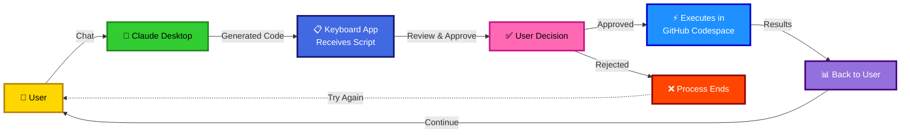

<div align="center">

# [Keyboard](https://www.keyboard.dev/)

### Your AI Client can now actually DO things, not just talk about them

*Works in Claude, Cursor, VS Code, any AI Client that supports MCP (Model Context Protocol)*

[](https://docs.keyboard.dev/) [](LICENSE) [](https://discord.gg/UxsRWtV6M2)

</div>


## Before Keyboard ❌
- **You:** "Send an email to my team about tomorrow's meeting"  
- **Claude:** "Here's how you would write that email..."  
- *You manually copy, paste, send*

## With Keyboard ✅
- **You:** "Send an email to my team about tomorrow's meeting"  
- **Claude:** "I'll send that email for you" → *[You approve]* → **Email sent** ✓

## 🔥 What Can Your AI Client Actually Do Now?

- **📧 Send emails** through Gmail
- **📅 Schedule meetings** in Google Calendar  
- **📊 Create surveys** with Typeform
- **🎫 Create tickets** in Linear, Jira, Asana, your task manager
- **📝 Edit documents** in Google Drive, Notion, Confluence, your internal knowledgebase
- **💬 Send messages** in Slack
- **📈 Manage** your CRM
- **🔗 Any API you connect** - Twitter, Stripe, GitHub, anything

All running securely in YOUR GitHub with YOUR API keys.

## See It In Action (30 seconds)


## Get Started (5 minutes)

See [Quickstart](https://docs.keyboard.dev/quickstart) to get set up. The process will require you to: 

- Install the Keyboard extension (dxt file)
- Download the Keyboard desktop app
- Provide Keyboard access to an isolated Keyboard repo you will fork in the setup
- Connect any apps you'd like to use in your AI client

## When Should I Use Keyboard?

When you want your AI client (Claude, Cursor, ChatGPT, etc.) to execute tasks on your behalf. Connect your tools to your own secure GitHub, ask Claude to execute something in one of them and watch Keyboard go to work. With Keyboard, you don’t need to install an MCP server for each app or service you’d like to connect to your AI client. Instead, any app with an API key can be connected to Keyboard while giving you control to approve or deny the actions.

## The Secret: You Stay In Control

Every action shows you the exact code BEFORE it runs:

```markdown
// Claude wants to run this:
await gmail.send({
  to: "team@company.com",
  subject: "Tomorrow's meeting",
  body: "Hi team, ..."
})

[Approve] [Reject] [Edit]
```

Your data never leaves your GitHub. Keyboard can't see your API keys. Always secure, always private.

## Example Automations

- "Check my calendar and email everyone in my next meeting"
- "Find all unread customer emails and create support tickets"
- "Post this update to Twitter and LinkedIn"
- "Create a Typeform survey from this list of questions"
- "Find that document about Q3 planning and summarize it"

## Key Features

- **Connect Your Tools:** One MCP, all your tools. Provide Keyboard access to third party tools in your own GitHub environment.
- **Private:** Keyboard doesn't have access to your API keys, it only has access to the GitHub Codespace.
- **Secure Workflows:** Run code safely within your own controlled environment with human oriented approval workflows.
- **Human Control:** You approve what code is executed, you also approve what data is sent is back to MCP clients like Claude.

## How Keyboard Works

Keyboard creates a seamless bridge between AI conversations and actual code execution through a simple approval-based workflow.

### How it works in 3 steps:

1. **Ask your AI** to execute a task using your connected tools
2. **Review & approve** the explanation and generated code in the Keyboard desktop app
3. **Watch it execute** safely in your own GitHub Codespace

### Full Breakdown



The process is straightforward:

1. **User Interaction**: You chat with Claude (or any MCP-compatible AI client) normally
2. **Code Generation**: Claude generates the code needed to accomplish your task in your connected apps
3. **User Approval**: Keyboard presents the generated code for your review and approval
4. **Secure Execution**: Once approved, the code runs safely in an isolated GitHub Codespace
5. **Results**: You get real results, not just code suggestions

This architecture ensures you maintain full control while enabling your AI to actually execute tasks rather than just providing instructions.

## Documentation

Full docs can be found at https://docs.keyboard.dev/ but see below for direct links to a few docs that will help you use Keyboard after you get set up:

* [Learn how to connect your third party apps](https://docs.keyboard.dev/docs/third-party-apps)
* [Tips for using Keyboard with Claude](https://docs.keyboard.dev/docs/usability-tips-with-claude)

## Run & Contribute to Keyboard

If you want to run the whole codebase and contribute to both the MCP server and the desktop client see the instructions below.

1️⃣ Clone the monorepo (with submodules)

```bash
git clone --recursive https://github.com/keyboard-dev/keyboard-local.git
cd keyboard-local
```

2️⃣ Start Approver Client (Electron Desktop App)

```bash
cd apps/approver-client
git checkout main
git pull origin main
npm install && npm run dev
```

3️⃣ Start Keyboard MCP Server

In a separate terminal:

```bash
cd apps/keyboard-mcp
git checkout main
git pull origin main
npm install && npm run build
```

## 🔥 Important: How to Contribute

✅ DO THIS:

* Make changes in apps/approver-client/ or apps/keyboard-mcp/
* Create branches and commits like normal
* Submit PRs to the individual repos:

Approver Client changes → https://github.com/keyboard-dev/approver-client

Keyboard MCP changes → https://github.com/keyboard-dev/keyboard-mcp

❌ DON'T DO THIS:

* Don't submit PRs to this monorepo (unless changing this README)
* Don't worry about "updating submodules" - handled automatically

That's It! Work like you normally would. This repo just saves you from cloning multiple repositories.

---

## ⚠️ Disclaimer

Keyboard executes code in your GitHub Codspace environment. While we've designed it with security in mind, you should:

- Review all code before approving execution
- Only connect trusted applications
- Understand that API calls may have real-world effects
- Don't give Keyboard or by extension your GitHub codespace permissions that could in general ruin your life or career

This software is provided "as is" without warranty of any kind, express or implied.

---

**⭐ If Keyboard helps you work more securely with AI, please give us a star!**

Join our [Discord](https://discord.gg/UxsRWtV6M2) if you have any questions. We'd love to hear from you.

*Built with ❤️ by the Keyboard team*


